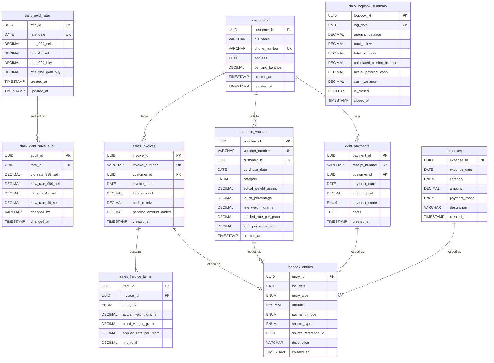

# Owner-provided database schema reference

**Source:** ER diagram supplied by the project owner on 2026-10-02.  
**Status:** Reference only; this is not an SQL migration and has not been verified against a running database.

The diagram has been retained as supplied, including the entities, columns, key annotations, and relationships. The normalized standalone Mermaid file is [`diagrams/database_schema.mmd`](./diagrams/database_schema.mmd). For field descriptions and observed API alignment, see [data_model.md](./data_model.md).

The owner subsequently provided an authorized-device table definition. It is saved with its comments and seed example in [authorised_devices_reference.sql](./authorised_devices_reference.sql), also as reference only. The table identifier is `authorised_devices`, matching the owner's database.

- The table needs a `device_public_key` column for the approved Ed25519 challenge-response login. That additive deployment SQL is in [backend/device_auth_schema.sql](../backend/device_auth_schema.sql); this repository has no migration runner, so apply it manually after review and backup.

The table uses `uuid_generate_v4()`, so applying it requires the corresponding UUID extension to be available. Its seed uses `ON CONFLICT (device_id) DO NOTHING`; a row already using the same GUID under another ID can still cause a unique-GUID conflict. Do not apply this reference without confirming the target schema and intended idempotent enrollment process.

### Clarifications still needed before using this as an executable schema

- Enumerate the allowed values for each ENUM.
- Specify DECIMAL precision and scale, particularly the requested money and weight precisions.
- Specify nullability, defaults, and delete/update behavior for foreign keys.
- Decide whether rate audit history must include all four rates.
- Confirm how `logbook_entries.source_reference_id` is constrained and how exactly-once postings are enforced.
